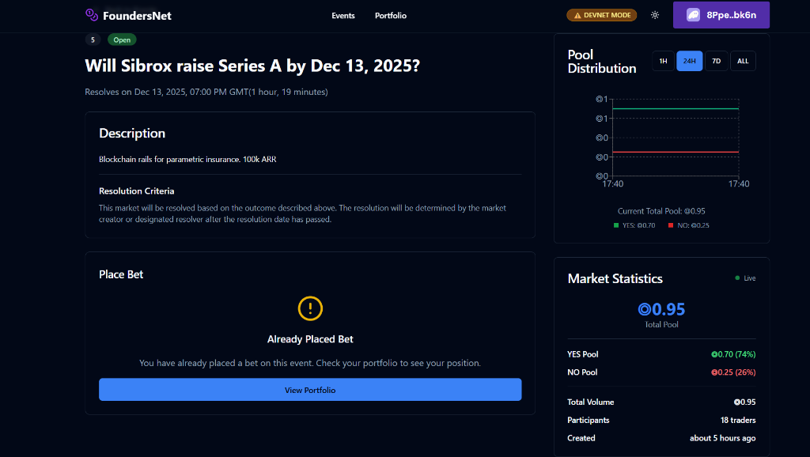
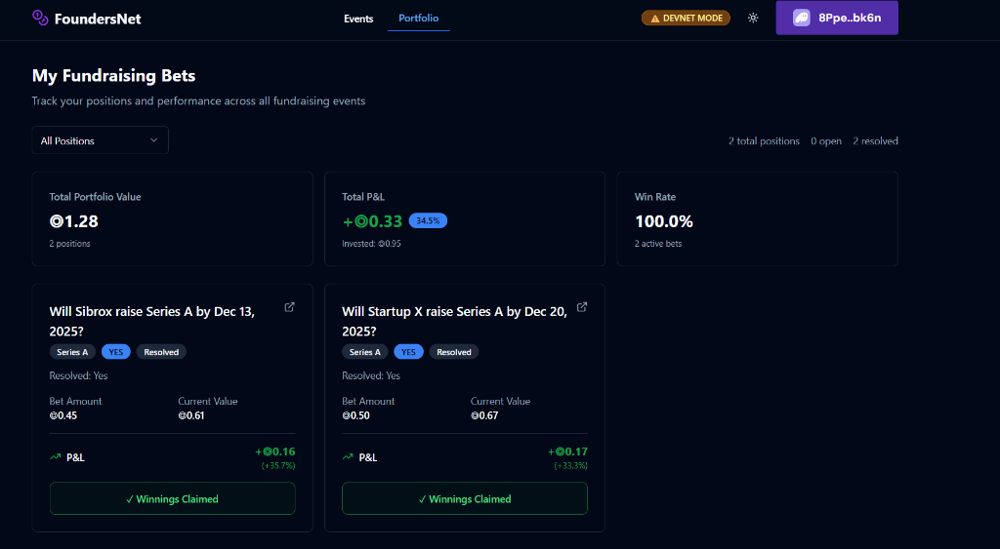
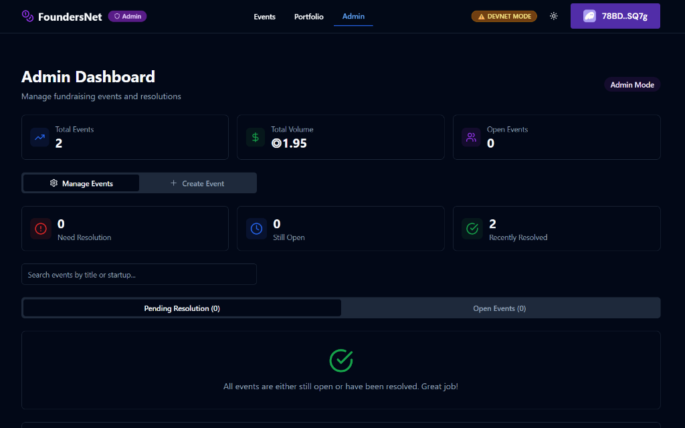

<div align="center">

# 🚀 FoundersNet

### Decentralized Prediction Markets for Startup Fundraising

[](https://solana.com)
[](https://www.anchor-lang.com/)
[](https://react.dev)
[](https://www.typescriptlang.org/)

*Predict startup success. Bet on fundraising outcomes. Built 100% on Solana.*

</div>

---

## 📸 Screenshots

<div align="center">

### Market Detail View

*Real-time pool distribution, market statistics, and trading interface*

---

### Portfolio & Winnings

*Track positions, P&L, and claim winnings from resolved markets*

---

### Admin Dashboard

*Create events, manage resolutions, and monitor platform activity*

</div>

---

## 🎯 What is FoundersNet?

FoundersNet is a **decentralized prediction market** where users can bet on whether startups will successfully raise funding (Seed, Series A, Series B, etc.) by specific dates.

**Key Features:**
- 🎰 **Bet on YES or NO** outcomes for fundraising events
- 💰 **Pool-based payouts** — winners split the entire pool proportionally
- 🔐 **Fully on-chain** — all logic, state, and funds live on Solana
- ⚡ **Instant settlement** — claim winnings immediately after resolution
- 🛡️ **Trustless** — no centralized custody, funds controlled by smart contract

---

## 🏗️ Architecture

FoundersNet is a **pure dApp** — there's no backend server or database. Everything runs on:

```
┌─────────────────────────────────────────────────────────────────┐
│                         CLIENT (React)                          │
│  • Wallet Connection (Phantom, Solflare)                        │
│  • Real-time market data via RPC                                │
│  • Transaction building & signing                               │
└──────────────────────────┬──────────────────────────────────────┘
                           │ @solana/web3.js + Anchor
                           ▼
┌─────────────────────────────────────────────────────────────────┐
│                    SOLANA BLOCKCHAIN (Devnet)                   │
│                                                                 │
│  ┌─────────────────────────────────────────────────────────┐   │
│  │                 FoundersNet Program                      │   │
│  │                                                          │   │
│  │  • create_market()  — Create prediction events           │   │
│  │  • place_bet()      — Bet SOL on YES/NO outcomes        │   │
│  │  • resolve_market() — Admin resolves with outcome       │   │
│  │  • claim_winnings() — Winners claim their payouts       │   │
│  │                                                          │   │
│  └─────────────────────────────────────────────────────────┘   │
│                                                                 │
│  ┌──────────────────┐    ┌──────────────────────────────────┐   │
│  │  Market Account  │    │      UserPosition PDA            │   │
│  │  • title         │    │  • user + market (seeds)         │   │
│  │  • yes_pool      │    │  • yes_shares / no_shares        │   │
│  │  • no_pool       │    │  • total_cost                    │   │
│  │  • status        │    │  • claimed flag                  │   │
│  │  • outcome       │    │                                  │   │
│  └──────────────────┘    └──────────────────────────────────┘   │
└─────────────────────────────────────────────────────────────────┘
```

---

## ⚙️ How Solana is Used

### 1. **Smart Contract (Anchor Program)**

The core logic lives in a Solana program written with the [Anchor framework](https://www.anchor-lang.com/):

| Instruction | Description | Permission |
|-------------|-------------|------------|
| `create_market` | Creates a new prediction event with initial liquidity | Admin only |
| `place_bet` | Places a bet on YES or NO outcome | Any user |
| `resolve_market` | Resolves the event with YES/NO/INVALID | Admin only |
| `claim_winnings` | Claims proportional payout from resolved market | Winner only |

### 2. **Program Derived Addresses (PDAs)**

User positions are stored in PDAs for deterministic, trustless access:

```rust
// Seeds for user position PDA
[b"user_position", user_pubkey, market_pubkey]
```

This ensures:
- ✅ **One bet per user per event** — enforced at the protocol level
- ✅ **No double-claiming** — tracked via `claimed` flag
- ✅ **Permissionless reads** — anyone can verify positions on-chain

### 3. **SOL as Native Currency**

All bets and payouts are in **native SOL** (no token needed):

- Minimum bet: **0.01 SOL** 
- Minimum liquidity: **0.5 SOL**
- Transaction fees: **~0.00025 SOL** (paid to validators)

### 4. **Pool-Splitting Payout Formula**

Winners split the entire pool proportionally based on their shares:

```
Your Payout = (Your Shares / Total Winning Shares) × Total Pool

Example:
- Total Pool: 1.0 SOL (YES: 0.7 SOL, NO: 0.3 SOL)
- You bet 0.2 SOL on YES
- YES wins!
- Your Payout = (0.2 / 0.7) × 1.0 = 0.286 SOL
- Profit = 0.286 - 0.2 = 0.086 SOL (+43% return!)
```

---

## 🚀 Quick Start

### Prerequisites

- Node.js 18+
- Rust & Cargo
- Solana CLI
- Anchor CLI

### 1. Clone & Install

```bash
git clone https://github.com/your-repo/foundersnet-sol.git
cd foundersnet-sol

# Install frontend dependencies
cd client
npm install
```

### 2. Configure Environment

```bash
# Copy example env file
cp .env.example .env

# Edit with your values
VITE_SOLANA_NETWORK=devnet
VITE_PROGRAM_ID=EEZJxm2YmPHxH2VfqPXaS2k3qSmRhvKHEFMxjbzNxNfQ
VITE_ADMIN_WALLET=78BDAjB4oTdjS4S734Ge2sRWWnHGDDJmPigbp27bSQ7g
```

### 3. Run the App

```bash
npm run dev
# Open http://localhost:5173
```

### 4. Connect Wallet

1. Install [Phantom](https://phantom.app/) or [Solflare](https://solflare.com/)
2. Switch to **Devnet** in wallet settings
3. Get free devnet SOL from [sol-faucet.com](https://solfaucet.com/)
4. Connect wallet to FoundersNet

---

## 🏛️ Program Deployment

### Build the Program

```bash
anchor build
```

### Deploy to Devnet

```bash
anchor deploy --provider.cluster devnet
```

### Update Program ID

After deployment, update the program ID in:
- `Anchor.toml`
- `client/.env` (VITE_PROGRAM_ID)

---

## 📁 Project Structure

```
foundersnet-sol/
├── programs/
│   └── foundersnet/
│       ├── src/lib.rs          # Main Anchor program (435 lines)
│       ├── Cargo.toml          # Rust dependencies
│       └── README.md           # Program documentation
│
├── client/                      # React frontend
│   ├── src/
│   │   ├── components/         # UI components
│   │   ├── hooks/              # Solana integration hooks
│   │   ├── lib/                # Utilities & calculations
│   │   ├── pages/              # Route pages
│   │   └── idl/                # Anchor IDL for frontend
│   └── package.json
│
├── docs/
│   └── screenshots/            # App screenshots
│
├── Anchor.toml                  # Anchor configuration
├── Cargo.toml                   # Rust workspace
└── README.md                    # This file
```

---

## 🔐 Security Features

| Feature | Implementation |
|---------|----------------|
| **One bet per event** | Enforced via PDA seeds — can't create duplicate positions |
| **Admin-only resolution** | Wallet check against hardcoded admin pubkey |
| **No double claims** | `claimed` flag in UserPosition account |
| **Arithmetic safety** | All calculations use checked math |
| **No rug pulls** | Funds locked in program, only released on resolution |

---

## 📊 Technical Specifications

| Metric | Value |
|--------|-------|
| Program Size | ~13 KB |
| Market Account | ~500 bytes |
| User Position Account | ~100 bytes |
| Transaction Cost | ~5000 lamports (~$0.001) |
| Min Bet | 0.01 SOL |
| Min Liquidity | 0.5 SOL |

---

## 🛠️ Tech Stack

| Layer | Technology |
|-------|------------|
| **Blockchain** | Solana (Devnet) |
| **Smart Contracts** | Anchor Framework (Rust) |
| **Frontend** | React 18 + TypeScript |
| **Styling** | Tailwind CSS + shadcn/ui |
| **Wallet** | @solana/wallet-adapter |
| **State** | TanStack Query (React Query) |

---

## 📜 License

MIT License — see [LICENSE](LICENSE) for details.

---

## 🙏 Acknowledgments

- [Solana Foundation](https://solana.org/) for the blockchain infrastructure
- [Anchor](https://www.anchor-lang.com/) for the developer framework
- [Phantom](https://phantom.app/) for wallet integration

---

<div align="center">

**Built with ❤️ on Solana**

[Website](https://foundersnet.app) • [Twitter](https://twitter.com/foundersnet) • [Discord](https://discord.gg/foundersnet)

</div>
